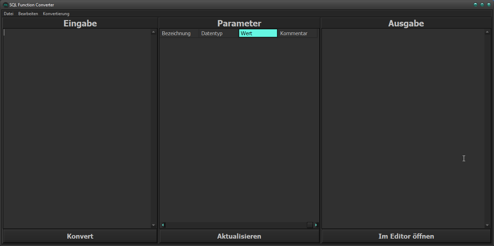
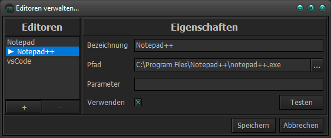
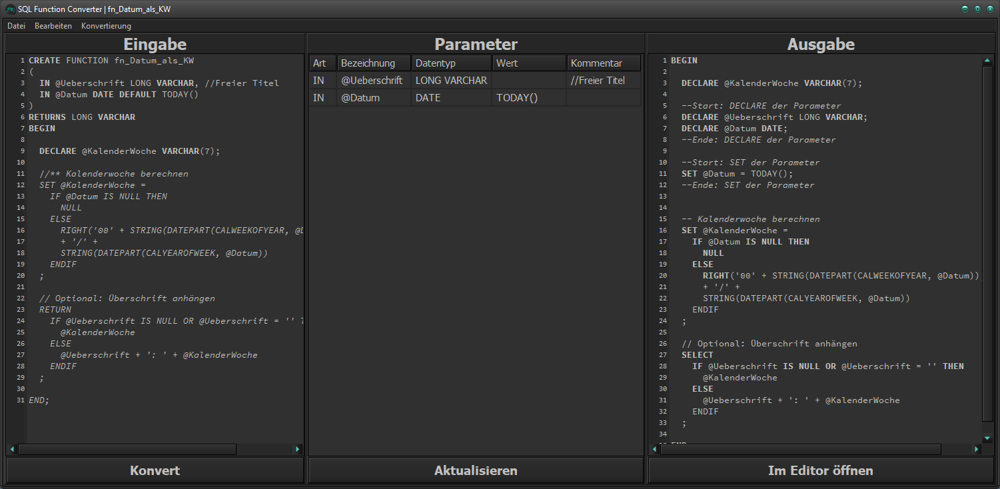

# SQL Function Converter



Ein kleines Windows-Tool in Delphi/VCL zum schnellen Vorbereiten von SQL-Funktionen & SQL-Prozeduren für Tests, Debugging und manuelle Ausführung.

Der Converter liest die Parameter aus einem `CREATE FUNCTION`- oder `CREATE PROCEDURE`-Header, übernimmt sie in ein editierbares Grid und erzeugt daraus einen lauffähigen SQL-Block ab `BEGIN` inklusive `DECLARE`- und `SET`-Anweisungen.

## Was macht das Tool?

- Extrahiert `IN`, `OUT` und `INOUT`-Parameter aus dem SQL-Header
- Übernimmt Bezeichnung, Datentyp, Default-Wert und Kommentare in ein Grid
- Erlaubt manuelle Anpassungen von Parameterwerten vor der Ausgabe
- Fügt automatisch `DECLARE`- und `SET`-Blöcke in den SQL-Body ein
- Kann `RETURN` sowie `OUT`/`INOUT`-Parameter optional in ein `SELECT` umwandeln
- Kann Kommentar-Marker wie `//***` in SQL-Kommentare `--` konvertieren
- Öffnet die generierte Ausgabe direkt im konfigurierten Editor

## Anwendungsfall

Das Projekt ist praktisch, wenn bestehende SQL Anywhere / ASA-Funktionen oder -Prozeduren schnell in einen testbaren Ausführungsblock überführt werden sollen, ohne Parameter jedes Mal von Hand als Variablen vorzubereiten.

### Typischer Ablauf:

1. SQL-Definition in die linke Eingabe einfügen oder per Datei laden.
2. Mit `Konvert` die Parameter analysieren lassen.
3. Werte im mittleren Grid anpassen.
4. Mit `Aktualisieren` den Ausgabe-SQL-Block erzeugen.
5. Die Ausgabe speichern oder direkt im Editor öffnen.

## Funktionen im Detail

### Parameter-Erkennung

Unterstützt werden unter anderem:

- `IN`, `OUT` und `INOUT`
- Datentypen wie `VARCHAR`, `LONG VARCHAR`, `INTEGER`, `NUMBERIC`, `DATE`, ...
- Inline-Kommentare mit `//`, `/*` oder `--`

### Ausgabe-Erzeugung

Die generierte Ausgabe beginnt beim `BEGIN`-Block der übergebenen SQL-Definition. 
Der Converter:
- fügt neue `DECLARE`-Anweisungen für die Parameter ein
- setzt vorhandene Werte per `SET`
- ergänzt bei Bedarf eine `SELECT`-Rückgabe für `RETURN` und `OUT`-Parameter

### Editor-Integration

Es können mehrere Editoren hinterlegt werden, wie z.B.:
- Notepad
- Notepad++
- Visual Studio Code



Zusatzparameter für den Editor-Aufruf lassen sich ebenfalls im Parameter-Edit speichern.

## Beispiel

Aus einer Definition wie:

```sql
CREATE FUNCTION %PROC% (IN @Kun_Nummer INTEGER DEFAULT NULL) // Kunde
RETURNS VARCHAR(7)
BEGIN
  DECLARE varResult VARCHAR(7);
  RETURN varResult;
END;
```

wird eine Ausgabe in dieser Art erzeugt:

```sql
BEGIN
  DECLARE varResult VARCHAR(7);

  --Start: DECLARE der Parameter
  DECLARE @Kun_Nummer INTEGER;
  --Ende: DECLARE der Parameter

  --Start: SET der Parameter
  SET @Kun_Nummer = NULL;
  --Ende: SET der Parameter

  SELECT varResult;
END;
```

Die genaue Ausgabe hängt von den gesetzten Optionen und den eingetragenen Parameterwerten ab.

## Bedienung

### Hauptansicht

- Links: SQL-Eingabe
- Mitte: Erkannte Parameter inklusive Werte und Kommentare
- Rechts: Ausführbare SQL-Anweisung



### Wichtige Aktionen

- `Konvert`: Liest den Header ein und füllt das Grid
- `Aktualisieren`: Übernimmt die Grid-Werte in die Ausgabe
- `Im Editor öffnen`: Speichert die Ausgabe in eine Datei und öffnet diese im konfigurierten Standard-Editor

### Nützliche Shortcuts

- `F9`: Eingabe konvertieren
- `F5`: Ausgabe aktualisieren
- `F1`: Aktuelle Spaltenbreite an Inhalt anpassen
- `Entf`: Aktuelle Grid-Zelle leeren
- `Enter`: Im Grid zur nächsten Zeile springen

## Konfiguration

Die Anwendung speichert ihre Einstellungen standardmäßig unter:

```text
%APPDATA%\SQL Function Converter\
```

Verwendete Dateien:

- `Fx_Settings.ini` für Fensterzustand, Spalten, Theme und Konvertierungsoptionen
- `Fx_Editors.ini` für Editor-Profile und den aktiven Ausgabe-Editor
- `Fx_Output.sql` als generierte Ausgabedatei für den Editor-Aufruf
- `Fx_EditorTest.sql` als generierte Ausgabedatei für den Editor-Test

Falls das Verzeichnis unter `%APPDATA%` nicht angelegt werden kann, verwendet die Anwendung stattdessen das Verzeichnis der EXE.

## Projektstruktur

```text
.
|- SQLFunctionConverter.dpr        Projektstart
|- Main.pas / Main.dfm             Hauptfenster und Konvertierungslogik
|- EditorSettings.pas / .dfm       Verwaltung der Ausgabe-Editoren
|- ConverterConst.pas              Konstanten und Konfigurationsschlüssel
|- Misc/Test-Functions/            Beispiel-/ und Test-SQLs
`- Release/SQLFunctionConverter.exe Vorcompilierte EXE
```

## Voraussetzungen

- Windows
- Embarcadero Delphi / RAD Studio mit VCL
- Zielplattform: `Win32`

Das Projekt ist als klassische VCL-Desktop-Anwendung aufgebaut.

## Build

Projektdatei:

```text
SQLFunctionConverter.dproj
```

Zum Bauen einfach in Delphi/RAD Studio öffnen und als `Win32` kompilieren.
Oder direkt die Release-Version aufrufen: [SQLFunctionConverter.exe](Release/SQLFunctionConverter.exe)

## Hinweise

- Das Tool ist auf SQL-Header mit klassischem `CREATE FUNCTION`- bzw. `CREATE PROCEDURE`-Aufbau ausgelegt
- Die Erkennung basiert auf String-Verarbeitung und Regex, nicht auf einem vollständigen SQL-Parser
- Sehr spezielle oder ungewöhnlich formatierte Definitionen können daher Nacharbeit im Grid erfordern

## Testdaten

Unter [Misc/Test-Functions](Misc/Test-Functions) liegen mehrere Beispielskripte, mit denen sich die Konvertierung schnell ausprobieren lässt.
